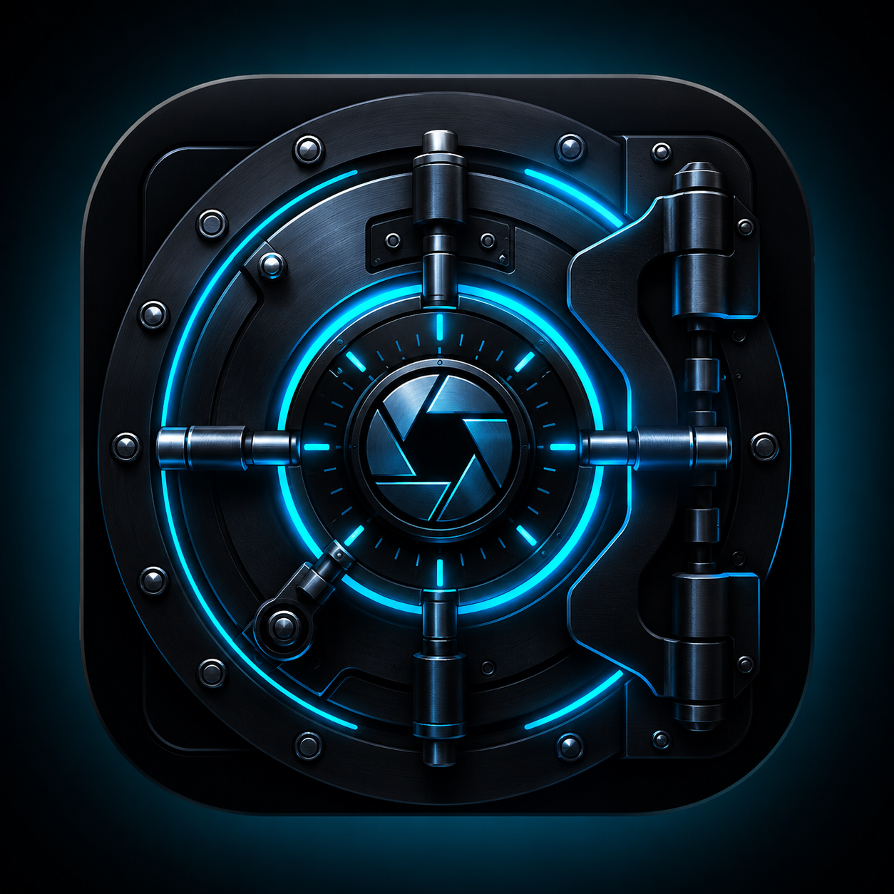

<div align="center">



# VaultGallery

**VaultGallery**

[](https://DamienSmith428.github.io/VaultGallery-app/)
[](https://github.com/DamienSmith428/VaultGallery-app/releases/latest)
[](LICENSE)
[](https://DamienSmith428.github.io/VaultGallery-app/)
[](https://DamienSmith428.github.io/SideStack-web/)

[**→ View App Page**](https://DamienSmith428.github.io/VaultGallery-app/) · [**↓ Download**](https://github.com/DamienSmith428/VaultGallery-app/releases/latest) · [**Changelog**](https://DamienSmith428.github.io/VaultGallery-app/changelog.html) · [**Privacy Policy**](https://DamienSmith428.github.io/VaultGallery-app/privacy.html)

</div>

---

## About

Vault Gallery is the most secure way to store your private photos and videos on Android. Every file is encrypted with AES-256 — the same standard used by banks and governments — and your encryption key never leaves your device's secure hardware. Import media directly from your camera roll, organize into albums, and browse your collection with a sleek modern gallery interface. Protected by PIN and biometric authentication, your vault locks automatically when you leave the app. Nobody sees what's inside except you.
Features:

Military-grade AES-256-GCM encryption
Fingerprint and face unlock support
Completely hidden from your system gallery
Album organization with full search
Recycle bin with auto-delete options
Favorites collection
Configurable auto-lock and storage quota
No ads. No cloud. No compromise.

---

## Download

Head to the [**latest release**](https://github.com/DamienSmith428/VaultGallery-app/releases/latest) and grab the APK for your device architecture.

| Architecture | Who it's for |
|---|---|
| `Universal` | Works on all supported Android devices — **recommended** |

> **Not sure which to pick?** Grab `arm64-v8a` — it covers most Android phones from 2016 and newer.

---

## Installation

1. Download the APK for your architecture above
2. Open the APK on your device
3. Allow installation from unknown sources if prompted
4. Install and enjoy

---

## Privacy

VaultGallery collects no data. No analytics, no telemetry, no accounts. Everything stays on your device. [Full privacy policy →](https://DamienSmith428.github.io/VaultGallery-app/privacy.html)

---

## Distributed via SideStack

This app is part of [SideStack](https://DamienSmith428.github.io/SideStack-web/) — an independent Android app store built outside the Play Store ecosystem.

---

## 📬 Get This App Listed in the SideStack Store

If you built this app using the SideStack Tool and want it to appear in the SideStack Android store, copy the config URL below and send it to **[@DamienSmith428](https://github.com/DamienSmith428)** — open an issue or reach out directly on GitHub.

```
https://raw.githubusercontent.com/DamienSmith428/VaultGallery-app/main/docs/config.json
```

Once added, your app will appear automatically in the SideStack store app for all users.

---

<div align="center">
<sub>Built by <a href="https://github.com/DamienSmith428">DamienSmith428</a> · MIT License</sub>
</div>
